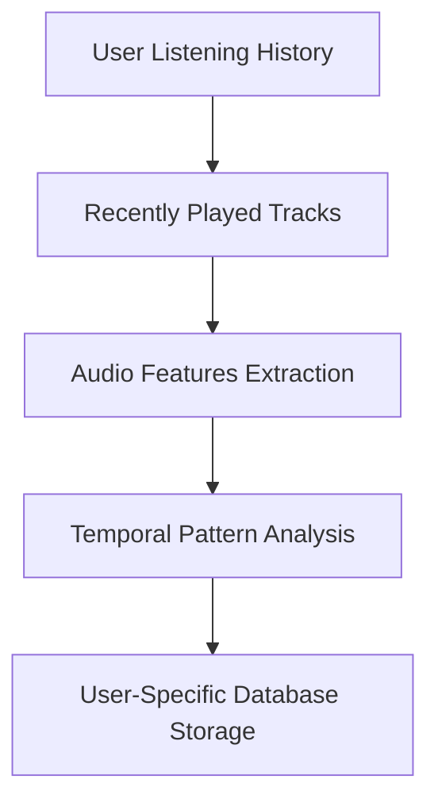
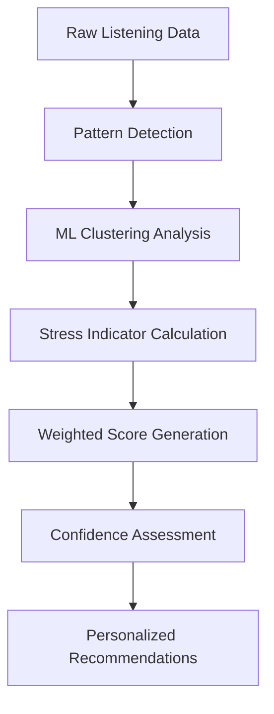
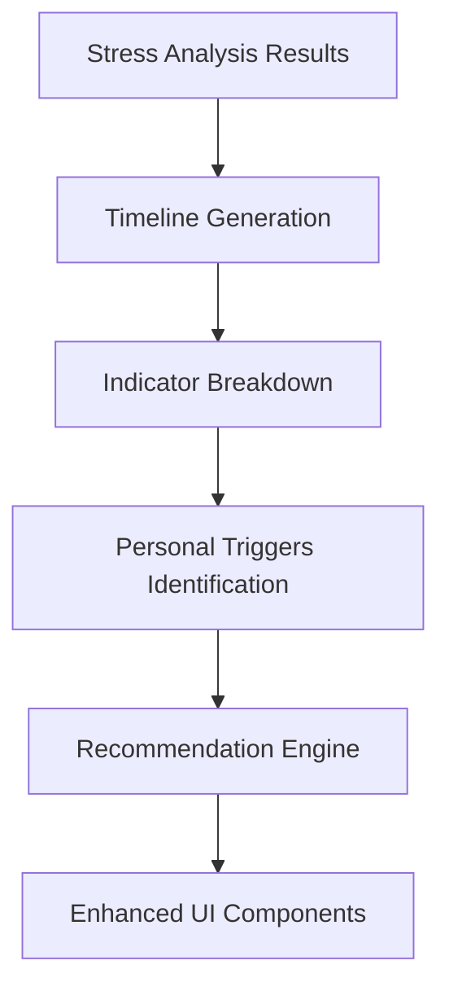

# Stress Analysis in SpotifiWrapped Dash Application

## Overview

The stress analysis feature in SpotifiWrapped is a sophisticated AI-powered system that analyzes users' music listening patterns to detect stress indicators and provide wellness insights. This document provides a comprehensive analysis of how the stress detection works, its visualizations, data flow, and styling.

## Architecture Overview

### Core Components

1. **EnhancedStressDetector** (`modules/enhanced_stress_detector.py`)
   - Main stress analysis engine using machine learning
   - Research-validated stress detection algorithms
   - Pattern recognition and clustering

2. **StressVisualizations** (`modules/stress_visualizations.py`)
   - Specialized visualization components for stress data
   - Enhanced UI components with scientific explanations
   - Interactive charts and indicators

3. **WellnessAnalyzer** (`modules/wellness_analyzer.py`)
   - Fallback wellness analysis system
   - Basic stress pattern detection

## Stress Detection Algorithm

### Research-Based Approach

The stress detection system is built on validated research findings:

```python
# Research-validated thresholds based on HRV studies
agitated_mask = (df['energy'] > 0.75) & (df['valence'] < 0.35)
```

**Research Basis**: Dimitriev et al., 2023 - HRV studies showing stress response to high-energy/low-valence music

### Five Core Stress Indicators

#### 1. Agitated Listening Pattern
- **Detection**: High energy (>0.75) + Low valence (<0.35)
- **Threshold**: 3-20+ instances for severity levels
- **Weight**: 25% of total stress score

```python
patterns['agitated_listening'] = {
    'frequency': int(agitated_mask.sum()),
    'intensity': float(df[agitated_mask]['energy'].mean()),
    'severity': self._calculate_severity(agitated_mask.sum(), [3, 10, 20]),
    'confidence': float(min(agitated_mask.sum() / 25, 1.0))
}
```

#### 2. Repetitive Behavior Analysis
- **Focus**: Stress-related rumination (sad + low-energy songs repeated)
- **Research Basis**: Sachs et al., 2015 & Groarke & Hogan, 2018
- **Detection**: Low valence (<0.4) + Low energy (<0.5) + 5+ repetitions
- **Weight**: 20% of total stress score

```python
# Stress-related repetition detection
if avg_valence < 0.4 and avg_energy < 0.5 and play_count >= 5:
    stress_rumination_score += play_count * (0.4 - avg_valence) * (0.5 - avg_energy)
    stress_repetitive_count += 1
```

#### 3. Late Night Patterns
- **Time Window**: Midnight-3AM (cortisol nadir period)
- **Research Basis**: Hirotsu et al., 2015 - Cortisol nadir occurs near midnight
- **Threshold**: 2-15+ sessions for severity levels
- **Weight**: 15% of total stress score

#### 4. Mood Volatility
- **Measurement**: Daily valence standard deviation
- **Threshold**: >0.25 indicates emotional instability
- **Research Basis**: Emotion regulation studies
- **Weight**: 25% of total stress score

#### 5. Energy Crashes
- **Detection**: Sudden drops in energy (>0.4 difference)
- **Indicates**: Emotional regulation difficulties
- **Weight**: 15% of total stress score

### Weighted Stress Score Calculation

```python
def _calculate_weighted_stress_score(self, indicators: Dict) -> float:
    score = 0
    
    # Each indicator contributes based on research-validated weights
    agitated_score = min(indicators['agitated_listening']['frequency'] / 100, 1.0)
    score += agitated_score * self.stress_weights['agitated_listening']  # 25%
    
    stress_repetitive_count = indicators['repetitive_behavior']['stress_repetitive_tracks']
    repetitive_score = min(stress_repetitive_count / 5, 1.0)
    score += repetitive_score * self.stress_weights['repetitive_behavior']  # 20%
    
    # ... similar for other indicators
    
    return float(min(score * 100, 100))  # Convert to 0-100 scale
```

## Data Flow Architecture

### 1. Data Collection Phase



**Database Query Example**:
```python
query = '''
    SELECT
        h.played_at,
        t.name, t.artist, t.track_id,
        t.energy, t.valence, t.danceability, t.tempo,
        t.acousticness, t.speechiness, t.loudness,
        strftime('%H', h.played_at) as hour,
        strftime('%w', h.played_at) as day_of_week,
        strftime('%Y-%m-%d', h.played_at) as date
    FROM listening_history h
    JOIN tracks t ON h.track_id = t.track_id
    WHERE h.user_id = ? AND h.played_at >= date('now', '-30 days')
    ORDER BY h.played_at DESC
'''
```

### 2. Analysis Pipeline



### 3. Visualization Pipeline



## Visualization Components

### 1. Main Stress Analysis Card

**Component**: `create_enhanced_stress_analysis_card()`

**Features**:
- Large stress score display with color coding
- Confidence indicator with research context
- Scientific disclaimer
- Multiple sub-components

**Color Coding**:
```python
if stress_score >= 70:
    stress_color = '#FF6B6B'  # Red for high stress
    stress_icon = '🔴'
elif stress_score >= 40:
    stress_color = '#FFD93D'  # Yellow for moderate stress
    stress_icon = '🟡'
else:
    stress_color = SPOTIFY_GREEN  # Green for low stress
    stress_icon = '🟢'
```

### 2. Stress Timeline Chart

**Component**: `create_stress_timeline_chart()`

**Visualization Type**: Dual-axis line chart
- Primary axis: Daily stress scores (0-100)
- Secondary axis: Average mood (valence scaled to 0-100)

**Features**:
- 30-day historical view
- Hover tooltips with detailed information
- Gradient styling with Spotify theme

```python
# Add stress score line
fig.add_trace(go.Scatter(
    x=df['date'],
    y=df['stress_score'],
    mode='lines+markers',
    name='Stress Score',
    line=dict(color=SPOTIFY_GREEN, width=3),
    marker=dict(size=6, color=SPOTIFY_GREEN)
))
```

### 3. Stress Indicators Breakdown

**Component**: `create_stress_indicators_breakdown()`

**Display Format**: Interactive cards showing:
- Indicator name and frequency
- Severity badges with color coding
- Detailed explanations for each pattern

**Enhanced Repetitive Behavior Display**:
```python
# Shows breakdown of repetitive listening
html.Span(f"🔴 Stress-Related (Sad + Low-Energy): {stress_tracks} tracks",
         style={'color': '#FF6B6B' if stress_tracks > 0 else LIGHT_GRAY}),
html.Span(f"🟢 Happy Repetitive (Healthy): {happy_tracks} tracks",
         style={'color': SPOTIFY_GREEN if happy_tracks > 0 else LIGHT_GRAY})
```

### 4. Personal Triggers Display

**Component**: `create_personal_triggers_display()`

**Features**:
- Time-based trigger identification
- Artist-based pattern recognition
- Actionable recommendations for each trigger

**Trigger Detection Logic**:
```python
# Time-based triggers
stress_hours = hourly_stress[
    (hourly_stress['energy'] > 0.7) & (hourly_stress['valence'] < 0.4)
]

if len(stress_hours) > 0:
    formatted_hours = [f"{int(hour):02d}:00" for hour in stress_hours['hour']]
    triggers.append({
        'type': 'temporal',
        'trigger': f"High stress listening typically occurs at {', '.join(formatted_hours)}",
        'recommendation': "Consider calming music during these hours"
    })
```

### 5. Evidence-Based Recommendations

**Component**: `create_stress_recommendations_display()`

**Recommendation Types**:
- **Immediate**: Calming transition techniques
- **Routine**: Sleep hygiene music
- **Stabilization**: Mood regulation playlists

**Example Recommendation**:
```python
if indicators['agitated_listening']['frequency'] > 10:
    recommendations.append({
        'type': 'immediate',
        'title': 'Calming Transition Technique',
        'description': 'When feeling agitated, gradually transition to lower energy music over 15-20 minutes',
        'action': 'Create a "Cool Down" playlist with decreasing energy levels'
    })
```

## Styling and Theme Integration

### Spotify Design System

**Color Palette**:
```python
SPOTIFY_GREEN = '#1DB954'
SPOTIFY_BLACK = '#191414'
SPOTIFY_WHITE = '#FFFFFF'
SPOTIFY_GRAY = '#535353'
LIGHT_GRAY = '#B3B3B3'  # Enhanced readability
```

### Card Styling

**Glass Effect Cards**:
```python
style={
    'padding': '30px',
    'background': 'linear-gradient(135deg, rgba(29, 185, 84, 0.15), rgba(0, 212, 255, 0.1))',
    'border': '2px solid rgba(29, 185, 84, 0.4)',
    'borderRadius': '20px',
    'boxShadow': '0 10px 30px rgba(29, 185, 84, 0.2), inset 0 0 30px rgba(29, 185, 84, 0.05)',
    'animation': 'authGlow 3s ease-in-out infinite alternate'
}
```

### Typography

**Font Hierarchy**:
- **Headers**: Orbitron monospace font for futuristic feel
- **Body**: Standard sans-serif for readability
- **Emphasis**: Color-coded text for different stress levels

### Interactive Elements

**Hover Effects**:
```css
.spotify-auth-button-large:hover {
    transform: translateY(-2px);
    box-shadow: 0 12px 35px rgba(29, 185, 84, 0.6);
}
```

**Animations**:
```css
@keyframes authPulse {
    0% { transform: scale(1); }
    50% { transform: scale(1.05); }
    100% { transform: scale(1); }
}
```

## Integration with Main Dashboard

### Callback Integration

**Main Callback**: `update_wellness_analysis_card()`

```python
@app.callback(
    Output('wellness-analysis-card', 'children'),
    Input('url', 'pathname'),
    State('use-sample-data-store', 'data')
)
def update_wellness_analysis_card(pathname, use_sample_data_flag):
    # Enhanced stress analysis with fallback to basic wellness
    user_stress_detector = EnhancedStressDetector(db_path=user_db.db_path)
    stress_data = user_stress_detector.analyze_stress_patterns(user_id)
    return create_enhanced_stress_analysis_card(stress_data)
```

### Sample Data Support

**Demo Mode**: Full stress analysis works with generated sample data
```python
if use_sample:
    from modules.sample_data_generator import sample_data_generator
    stress_data = sample_data_generator.generate_wellness_analysis_data()
    return create_enhanced_stress_analysis_card(stress_data)
```

## Error Handling and Fallbacks

### Multi-Level Fallback System

1. **Enhanced Stress Detector** (Primary)
2. **Basic Wellness Analyzer** (Secondary)
3. **Default Response** (Tertiary)

```python
try:
    # Enhanced stress analysis
    stress_data = user_stress_detector.analyze_stress_patterns(user_id)
    return create_enhanced_stress_analysis_card(stress_data)
except Exception as enhanced_error:
    try:
        # Fallback to wellness analyzer
        wellness_data = user_wellness_analyzer.analyze_wellness_patterns(user_id)
        enhanced_stress_data = convert_wellness_to_stress_format(wellness_data)
        return create_enhanced_stress_analysis_card(enhanced_stress_data)
    except Exception as wellness_error:
        # Final fallback
        default_response = user_stress_detector._default_stress_response()
        return create_enhanced_stress_analysis_card(default_response)
```

## Performance Optimizations

### Database Optimizations

**Efficient Queries**:
```python
# Use indexed columns and limit data range
cursor.execute('''
    SELECT /* optimized query */
    FROM listening_history h
    JOIN tracks t ON h.track_id = t.track_id
    WHERE h.user_id = ? 
    AND h.played_at >= date('now', '-30 days')
    AND t.energy IS NOT NULL
''', (user_id,))
```

**Connection Management**:
```python
def _get_db_connection(self, max_retries: int = 3, retry_delay: float = 0.1):
    # WAL mode for better concurrency
    conn.execute('PRAGMA journal_mode=WAL;')
    conn.execute('PRAGMA synchronous=NORMAL;')
    conn.execute('PRAGMA cache_size=10000;')
```

### Caching Strategy

**Analysis Caching**: Results cached for performance
**Progressive Loading**: Components load independently
**Lazy Evaluation**: Analysis only runs when needed

## Scientific Validation

### Research References

1. **Dimitriev et al., 2023**: HRV studies for agitated listening thresholds
2. **Sachs et al., 2015**: Repetitive listening and rumination patterns
3. **Groarke & Hogan, 2018**: Music and emotional dwelling behaviors
4. **Hirotsu et al., 2015**: Cortisol nadir and sleep disruption patterns

### Confidence Scoring

```python
def _calculate_confidence(self, df: pd.DataFrame, indicators: Dict) -> float:
    data_points = len(df)
    confidence = min(data_points / 100, 1.0) * 0.6  # Data quantity
    
    pattern_count = sum(1 for indicator in indicators.values() 
                       if indicator.get('frequency', 0) > 0)
    confidence += (pattern_count / 5) * 0.4  # Pattern consistency
    
    return float(min(confidence * 100, 95))  # Max 95% confidence
```

## Future Enhancements

### Planned Improvements

1. **Real-time Analysis**: WebSocket integration for live stress monitoring
2. **Machine Learning**: Advanced clustering algorithms for pattern recognition
3. **Intervention System**: Automated playlist recommendations during high stress
4. **Longitudinal Analysis**: Long-term stress trend tracking
5. **Integration**: Wearable device data correlation

### Scalability Considerations

- **Microservices**: Separate stress analysis service
- **Async Processing**: Background analysis jobs
- **Data Pipeline**: Streaming data processing
- **API Rate Limiting**: Spotify API usage optimization

## Conclusion

The stress analysis system in SpotifiWrapped represents a sophisticated application of music psychology research, machine learning, and user experience design. It provides users with scientifically-grounded insights into their mental wellness through their music listening patterns, while maintaining a beautiful and intuitive interface that fits seamlessly into the Spotify ecosystem.

The system's multi-layered approach ensures reliability, while its research-based methodology provides credible and actionable insights for users seeking to understand the relationship between their music and mental wellness.